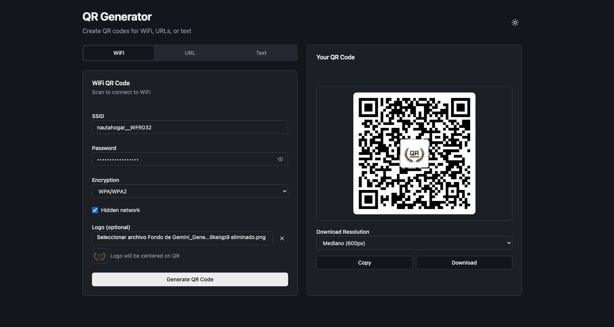

# QR Generator

> ⚡ Generado con asistencia de IA — aproximadamente una semana de desarrollo y revisión de código ahorrada.

Una herramienta versátil para generar códigos QR desarrollada con React, TypeScript y Tailwind CSS.

## 🌐 Demo en vivo

**Accedé al proyecto:** https://alejandro-gr01.github.io/qr-generator/



## Características

- **Tipos de QR disponibles:**
  - 📶 **WiFi** — Conectar directo a redes inalámbricas
  - 🔗 **URL** — Redirigir a enlaces web
  - 📝 **Texto** — Cualquier información en texto

- **Funcionalidades:**
  - 🌙 Modo oscuro/claro (se guarda en el navegador)
  - 🖼️ Subir logo de empresa centrado en el QR
  - ⬜ Esquinas redondeadas del QR
  - 💾 Descarga en varias resoluciones (300px - 2400px)
  - 📋 Copiar al portapapeles
  - 💻 Layout responsivo (2 columnas en desktop)

- **Stack técnico:**
  - React 19
  - TypeScript
  - Vite
  - Tailwind CSS v4
  - shadcn/ui
  - react-hook-form
  - qrcode
  - Componentes reutilizables

## Estructura de componentes

```
src/
├── components/
│   ├── Header.tsx         # Encabezado con toggle dark mode
│   ├── TypeSelector.tsx   # Selector de tipo de QR
│   ├── QRForm.tsx         # Formulario de entrada
│   ├── QRDisplay.tsx      # Visualización del QR
│   └── ui/               # Componentes shadcn/ui
├── pages/
│   └── QRGeneratorPage.tsx # Página principal
└── types/
    └── index.ts          # Tipos TypeScript
```

## Cómo usarlo

```bash
# Instalar dependencias
npm install

# Ejecutar en desarrollo
npm run dev

# Build para producción
npm run build
```

## Opciones de descarga

| Opción | Tamaño | Para |
|--------|--------|------|
| Pequeño | 300px | Redes sociales |
| Mediano | 600px | Pantallas |
| Grande | 1200px | Impresión mediana |
| Impresión | 2400px | Folletos, carteles |

## Autor

Alejandro Guzmán Rodríguez  
GitHub: https://github.com/alejandro-gr01

## Licencia

MIT